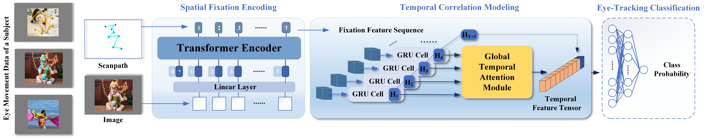

# spatiotemporal-attention-encoding-STAE
A spatiotemporal attention encoding (STAE) model jointly captures both spatial and temporal features for eye- tracking classification

Dataset remains updating··· It's so big to upload...
